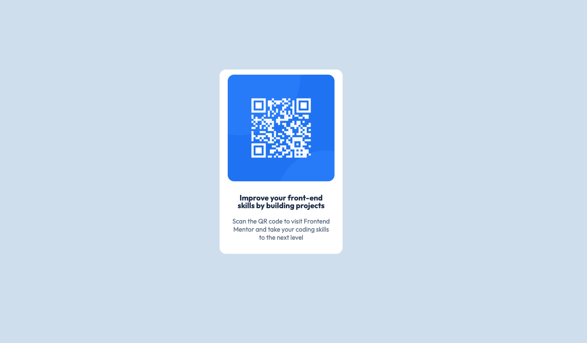

# Frontend Mentor - QR code component solution

This is a solution to the [QR code component challenge on Frontend Mentor](https://www.frontendmentor.io/challenges/qr-code-component-iux_sIO_H). Frontend Mentor challenges help you improve your coding skills by building realistic projects. 

## Table of contents

- [Overview](#overview)
  - [Screenshot](#screenshot)
  - [Links](#links)
- [My process](#my-process)
  - [Built with](#built-with)
  - [What I learned](#what-i-learned)
  - [Continued development](#continued-development)
  - [Useful resources](#useful-resources)
- [Author](#author)

## Overview

### Screenshot

### Links

- GitHub Solution URL: (https://github.com/dilaraj/QR-Code-Component) 
- Live Site URL: (https://dilaraj.github.io/QR-Code-Component/)

## My process

### Built with

- Semantic HTML5 markup
- CSS custom properties
- Flexbox
- CSS Grid
- [React](https://reactjs.org/) - JS library
- React Components

### What I learned
This project allowed me to apply my newly learnt React knowledge including:
 - Styling elements
 - Creating custom fonts
 - Inserting images
 - Creating reusable components (and how to use those components)

### Continued development

As I am a beginner in React, I would like to further strengthen my knowledge through application by continuing to do practical projects.
I would further like to strengthen my styling skills in CSS and my JavaScript knowledge

## Author

- Website - Not available yet
- Frontend Mentor - [@dilaraj](https://www.frontendmentor.io/profile/dilaraj)
- LeetCode - [@dilaraj](https://leetcode.com/u/dilaraj/)
- GitHub - [@dilaraj](https://github.com/dilaraj)